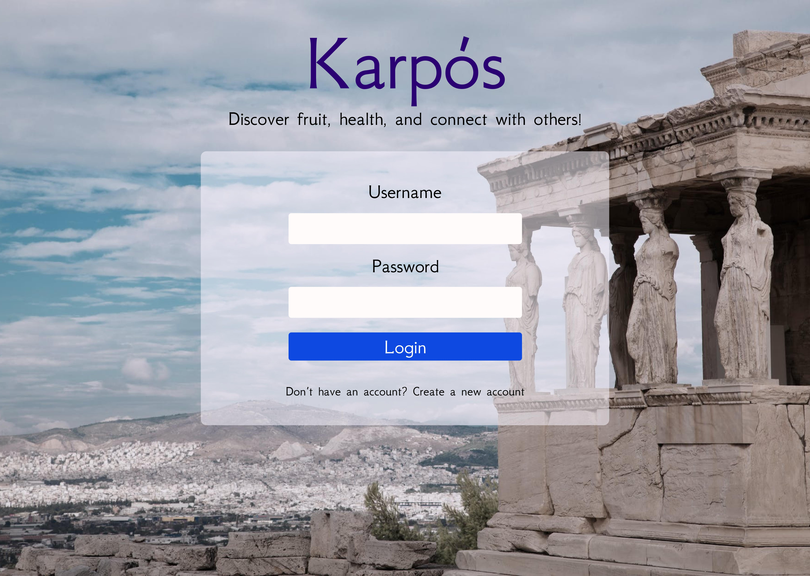
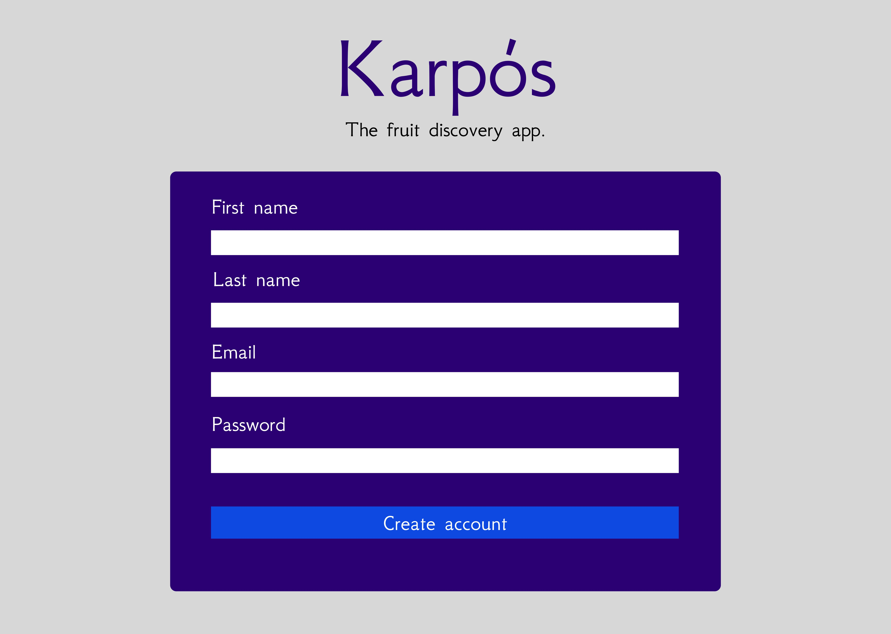
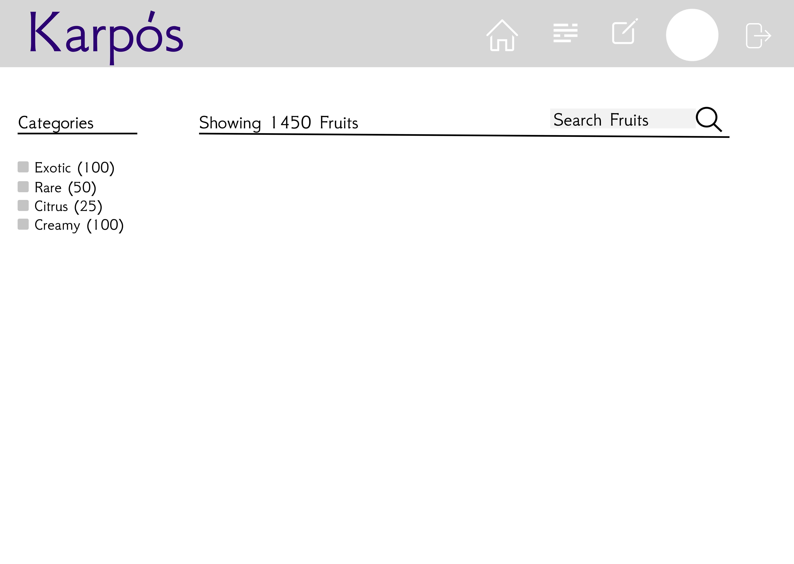
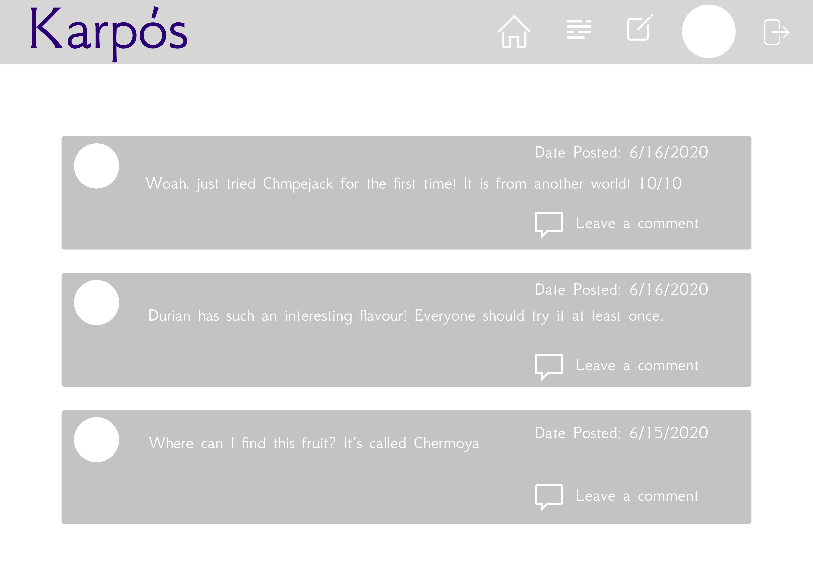
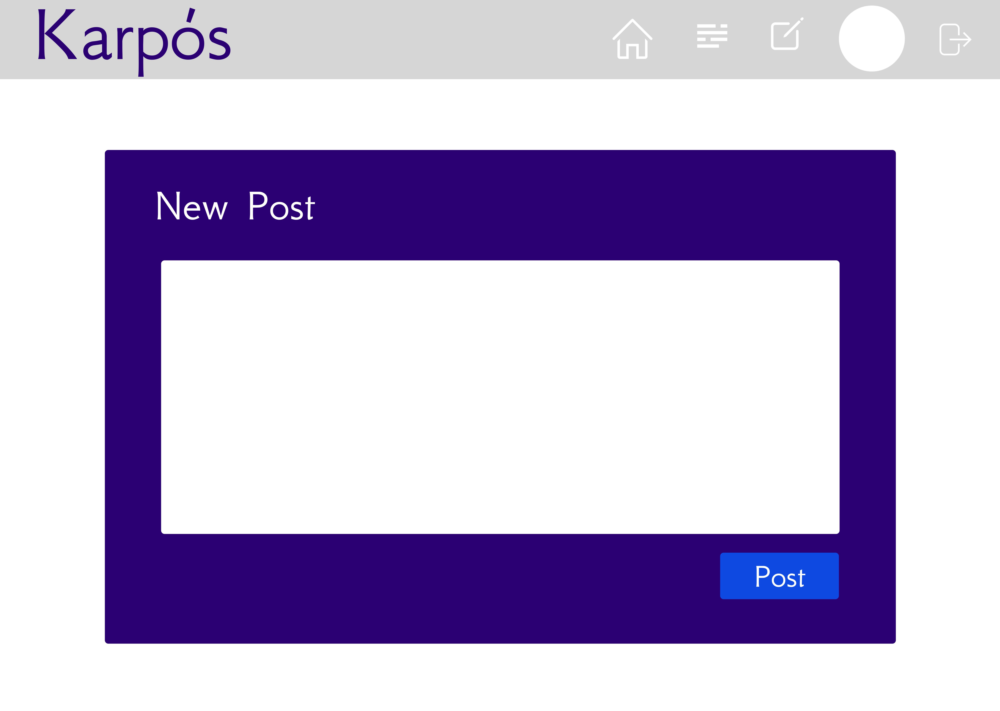
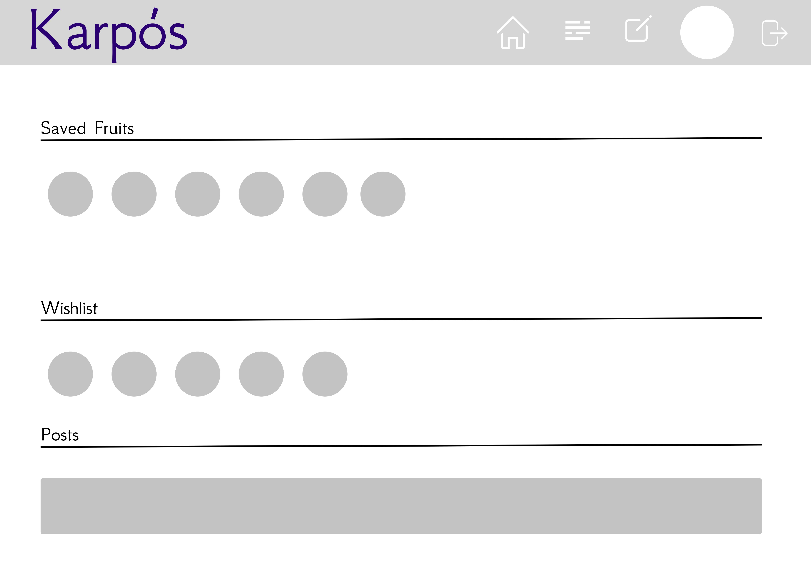

This project was bootstrapped with [Create React App](https://github.com/facebook/create-react-app).

## Project Plan

### Idea and Users

- What problem(s) does your app solve?

My app will make finding and learning about fruit fun and interactive with the social connection functionality which will allow users to post and share their fruit experience.

- How does it solve those problems?

Users can create an account, login, and share their experiences finding and eating exotic and non-exotic fruit. Users can also create a post, comment, and add fruits to a saved list so they can keep track of their favorties, as well as create a wishlist of fruits they'd like to try.

- Who is your target user?

Anyone who wants to explore the great world of fruit and health!

- How much experience do they have with technology?

From very little to possibly even no experience. I hope to have created something that anyone can use.

### Features

MVP
- Display list of fruits with detailed information
- Login functionality
- User can create and view a saved list of fruits
- User can create and view a wishlist of fruits
- User can create and delete a post
- User can comment on a post

Bonus
- User can follow/friend another user
- User can change their profile picture from the randomly generated default

### Views

- What views do you need to create to meet each feature in your app?

I need a login/authentication view, register, dashboard (that will display fruits to discover and search), profile (view saved list, posts, and wishlist), posts, and new post.

- How will the user get to each view?

There will be icons for each view in a global navigation component.

### Controllers

### Endpoints

- GET - get list of fruits from db
- GET - get list of posts from db
- GET - get list of user's posts from db
- GET - get list of user's saved fruit list from db
- GET - get list of user's fruit wishlist from db
- GET - get comments from db
- GET - get user
- POST - post fruit to saved fruit table in db
- POST - post fruit to wishlist table in db
- POST - post comment to table in db
- POST - register user in db
- POST - login user
- PUT - edit comment
- PUT - edit post
- PUT - edit name of fruit, description, and image
- DELETE - logout user
- DELETE - remove fruit from saved list
- DELETE - remove fruit from wishlist

### Schema